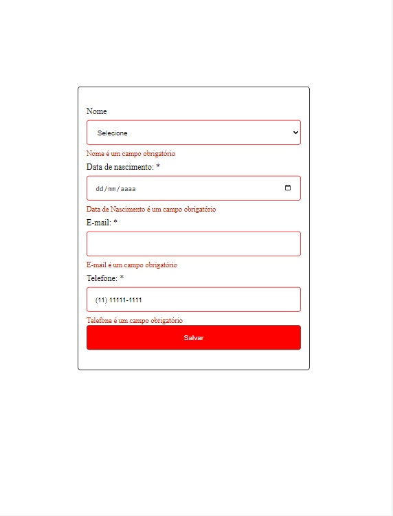

# Formulario com Validação ReactJs



## Tecnólogias Utilizadas

ReactJs
TypeScript
React-Hook-Forms
Yup

## Instalação

Você precisará clonar este repositório:

```sh
  $ git clone https://github.com/Bruno-Goudric/exemple-form-reactjs.git
```

Agora você precisa instalar os pacotes:

```sh
  $ yarn install
```

```sh
  $ npm install
```
